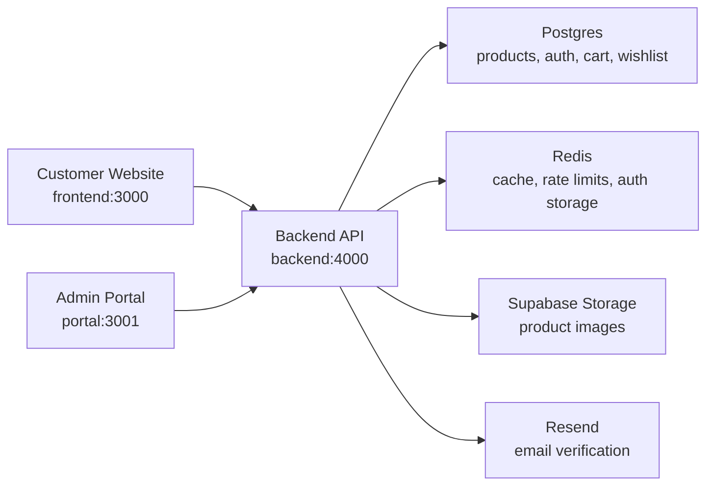

# YOORASARAH

YOORASARAH is a full-stack commerce platform with three applications in one repository:

- `frontend/` - the customer-facing storefront built with Next.js and Tailwind CSS.
- `backend/` - the Bun + Hono API for products, auth, cart, wishlist, admin operations, uploads, cache, and email.
- `portal/` - the admin portal for product management, image uploads, and stock updates.

The project is intentionally split by runtime responsibility. The storefront and admin portal never talk directly to the database or storage provider. They call the backend API, and the backend owns all database writes, Supabase Storage uploads, Redis cache/rate limits, and Better Auth sessions.

## Architecture



## Tech Stack

- Frontend: Next.js App Router, React, Tailwind CSS.
- Portal: Next.js App Router, React, Tailwind CSS.
- Backend: Bun runtime, Hono, TypeScript.
- Database: Postgres with Drizzle ORM.
- Auth: Better Auth with email/password, email verification, admin roles.
- Cache and limits: Redis.
- Storage: Supabase Storage for product images.
- Email: Resend for verification emails.

## Prerequisites

- Docker Desktop for local Postgres and Redis.
- Bun for the backend and portal.
- Node.js and npm for the customer frontend.
- A Supabase project and Resend API key for real image uploads and email verification.

## Local Quick Start

Start local infrastructure:

```bash
docker compose up -d
```

Start the backend:

```bash
cd backend
cp .env.example .env
bun install
bun run db:generate
bun run db:migrate
bun run db:seed
bun run dev
```

Start the customer website:

```bash
cd frontend
npm install
npm run dev
```

Start the admin portal:

```bash
cd portal
cp .env.example .env
bun install
bun run dev
```

Open the apps:

- Customer website: `http://localhost:3000`
- Backend API: `http://localhost:4000`
- Admin portal: `http://localhost:3001`

## Port Map

| Service | Port | Notes |
| --- | ---: | --- |
| Frontend | `3000` | Customer storefront |
| Portal | `3001` | Admin product portal |
| Backend | `4000` | API, auth, uploads |
| Postgres | `5432` | Docker Compose local database |
| Redis | `6379` | Docker Compose cache and rate limits |

## Development Flow

1. Start Docker services with `docker compose up -d`.
2. Start the backend first so the storefront and portal can reach the API.
3. Run backend migrations and seed data before testing product pages.
4. Start the frontend and verify storefront pages.
5. Start the portal and verify admin login, product list, product edit, image upload, and stock matrix behavior.
6. Run typecheck/build/test commands before committing changes.

## Customer User Flow

1. A guest visits the homepage and browses categories, latest products, best sellers, or all products.
2. Search calls the backend search endpoint and shows backend results only.
3. Product detail pages let customers choose color and size. Sold-out color/size combinations are disabled.
4. Add to cart stores the item through the backend without redirecting.
5. Cart items can be edited by quantity, color, and size.
6. Wishlist actions are stored through the backend and persist through the guest session cookie.
7. Customers can register, verify their email, log in, and manage profile settings.
8. Profile settings support email and password updates through Better Auth.

## Admin User Flow

1. Admin opens the portal and logs in through Better Auth.
2. The portal verifies the session and calls `/api/admin/me` to confirm admin role.
3. Dashboard loads all products from the backend admin API.
4. Admin can create or edit product metadata, category, price, publish date, sales count, and best seller status.
5. Images are uploaded through the backend, validated there, and stored in Supabase Storage.
6. Color variants can be managed with image galleries.
7. Stock is managed as a matrix by color and size. The total product stock is derived from variant stock.
8. Admin mutations invalidate related Redis cache entries so the storefront receives fresh data.

## Verification Commands

Backend:

```bash
cd backend
bun test
bun run typecheck
bun audit
```

Frontend:

```bash
cd frontend
npm run typecheck
npm run build
npm audit --audit-level=moderate
```

Portal:

```bash
cd portal
bun run typecheck
bun run build
bun audit
```

## Environment Files

Use `.env.example` files as templates:

- `backend/.env.example`
- `portal/.env.example`

Create local `.env` files from those templates. Do not commit real `.env` files.

The frontend can use `API_BASE_URL` or `NEXT_PUBLIC_API_BASE_URL` when the backend URL differs from `http://localhost:4000`.

## Security Notes

- Never commit `.env`, `.next`, `node_modules`, log files, or `SECURITY_AUDIT.md`.
- Production must use strong `BETTER_AUTH_SECRET` and admin credentials.
- `SUPABASE_SERVICE_ROLE_KEY` belongs only in the backend environment.
- Upload validation is enforced by the backend. The portal pre-check is only for user experience.
- Public storefront data must come from the backend API. Do not add runtime local fallback data.

## Troubleshooting

- Backend offline: storefront and portal show API errors because they do not use local runtime fallback data.
- Database errors: confirm Docker is running, then run `bun run db:migrate` in `backend/`.
- Redis errors: confirm Docker Redis is running on `6379`.
- CORS errors: add the frontend or portal origin to `CORS_ORIGIN` in `backend/.env`.
- Email verification not sent: configure `RESEND_API_KEY` and `EMAIL_FROM`.
- Upload failed: configure `SUPABASE_URL`, `SUPABASE_SERVICE_ROLE_KEY`, and `SUPABASE_STORAGE_BUCKET`.
- Image does not render: confirm the image host is allowed in the relevant `next.config.mjs`.
